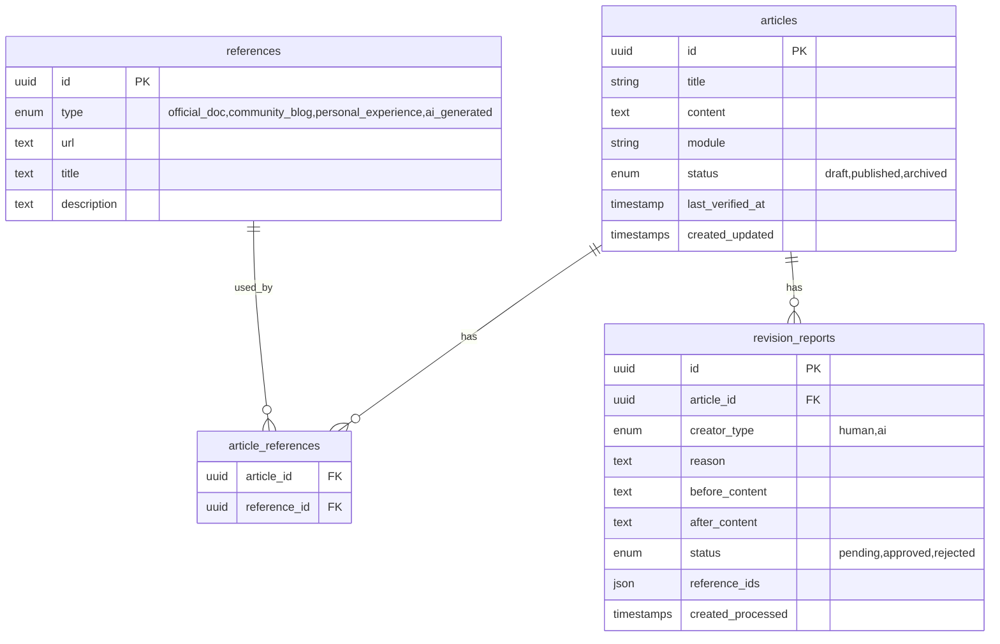

# SAPJP-pedia システム設計書（最終版）

AIと人間が共創する、自律型SAP百科事典プラットフォーム

---

## 1. 確定仕様

| 項目 | 決定事項 |
|------|----------|
| 認証 | 管理者のみ（Laravel Sanctum） |
| エディタ | プレーンMarkdown（プレビュー付き） |
| 通知 | ダッシュボードのみ |
| 検索 | キーワード検索 |
| モジュール | フリーテキスト入力（単一） |
| ファクトチェック | 3日に1回定期実行 |
| DB | XAMPP MySQL（要動作確認） |

---

## 2. データベース設計



---

## 3. API設計

### エンドポイント一覧

| Method | Endpoint | 認証 | 説明 |
|--------|----------|------|------|
| GET | `/api/search?q={query}` | 不要 | キーワード検索 |
| GET | `/api/articles/{id}` | 不要 | 記事詳細 |
| GET | `/api/articles/{id}/reports` | 不要 | 修正履歴一覧 |
| POST | `/api/articles/{id}/propose` | 不要 | 修正提案 |
| GET | `/api/reports/{id}` | 不要 | レポート詳細 |
| POST | `/api/articles` | 要 | 記事作成 |
| PUT | `/api/articles/{id}` | 要 | 記事更新 |
| DELETE | `/api/articles/{id}` | 要 | 記事削除 |
| PATCH | `/api/reports/{id}/approve` | 要 | 提案承認（同時に記事内容更新と参考文献保存を行う） |
| PATCH | `/api/reports/{id}/reject` | 要 | 提案却下 |

### レスポンス形式

#### GET /api/search?q={query}
```json
[
  {
    "id": 101,
    "title": "S/4HANA MM期間更新",
    "module": "MM",
    "last_verified_at": "2026-02-08T10:00:00Z"
  }
]
```

#### GET /api/articles/{id}
```json
{
  "id": 101,
  "title": "S/4HANA MM期間更新",
  "content": "# 概要\n...",
  "module": "MM",
  "status": "published",
  "last_verified_at": "2026-02-08T10:00:00Z",
  "references": [
    { "id": 1, "type": "official_doc", "title": "SAP Help Portal", "url": "..." }
  ]
}
```

#### GET /api/articles/{id}/reports
```json
[
  {
    "id": 501,
    "created_at": "2026-02-08T08:00:00Z",
    "creator_type": "ai",
    "reason": "最新ブログに基づき手順を最適化",
    "status": "approved"
  }
]
```

#### POST /api/articles/{id}/propose
```json
{
  "creator_type": "ai",
  "reason": "パッチノートにより権限が変更",
  "before_content": "# 修正前...",
  "after_content": "# 修正後...",
  "reference_urls": ["https://..."]
}
```

#### GET /api/reports/{id}
```json
{
  "id": 501,
  "article_id": 101,
  "creator_type": "ai",
  "reason": "...",
  "before_content": "旧テキスト...",
  "after_content": "新テキスト...",
  "references": [{ "title": "SAP Notes", "url": "..." }],
  "status": "pending"
}
```

---

## 4. ディレクトリ構成

```
sapjp-pedia/
├── backend/           # Laravel 11
├── frontend/          # Vue.js 3 + Vuetify 3
└── ai_engine/         # Python
```

---

## 5. 実装フェーズ

| Phase | 内容 |
|-------|------|
| 1 | Laravel初期化、DB、基本API |
| 2 | Vue.js、記事CRUD画面 |
| 3 | 修正提案・承認ワークフロー |
| 4 | Python AIエージェント |
| 5 | UI/UX改善 (ダークモード、テーブル、検索バー) |

---

---

## 6. Grokipedia Lite (Personal Knowledge Strategy)
2026-02-09: 個人ナレッジベースとしての利用を想定し、ファクトチェックの方針を緩和。

| 項目 | 変更前 (Strict) | 変更後 (Lite) |
|---|---|---|
| **基本方針** | 証拠がない情報はすべて削除 | 証拠がない情報は「要検証」として残す |
| **証拠基準** | 単一ソースでも可 | 可能であれば複数ソースを推奨 |
| **AIの振る舞い** | 疑わしきは削除 | 疑わしきは維持、明らかな誤りのみ修正 |

### プロンプト修正方針
*   「証拠リストにない情報の使用禁止」制約を撤廃。
*   「記事の原文を尊重し、証拠がない部分は削除せずに維持する」旨を指示。
*   「可能な限り複数のソースで裏付けをとる」旨を指示。
